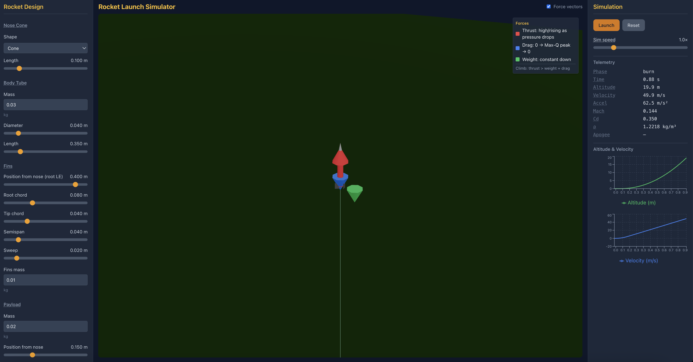

# Rocket Launch Aerodynamics Simulator

Interactive 3D rocket launch simulator with pre-launch stability analysis (Barrowman), real-time flight physics, and React Three Fiber visualization.


---

## CORE FEATURES

### 1. PRE-LAUNCH AERODYNAMICS ANALYSIS

- **Static stability calculator** using Barrowman equations (subsonic)
- **Center of Gravity (CG)** – calculated from component masses and positions; visualized on the rocket
- **Center of Pressure (CP)** – from Barrowman (nose, body, fins); visualized on the rocket
- **Stability margin** – CP should be 1–2 calibers behind CG for stable flight; displayed in calibers
- **Interactive sliders** to adjust:
  - Fin dimensions (span, root chord, tip chord, sweep, leading-edge position)
  - Nose cone shape (cone / ogive) and length
  - Body tube diameter and length
  - Payload mass and position
  - Motor selection and position
- **Real-time updates** – design changes immediately update CG, CP, and stability
- **Visual stability indicator** – stable/unstable warning and status

### 2. FLIGHT SIMULATION WITH REAL-TIME AERODYNAMICS

Physics Implemented:
- **Atmospheric model**  
  Air density and temperature as a function of altitude  
  (exponential density model; linear lapse rate up to 11 km)
- **Speed of sound**  
  `a = sqrt(γ · R · T)` computed from local temperature
- **Mach number**  
  `Mach = v / a`
- **Drag coefficient (Cd) vs Mach**
  - **Subsonic (Mach < 0.8):** Cd ≈ 0.35  
  - **Transonic (0.8–1.2):** Drag spike with smooth interpolation  
  - **Supersonic (Mach > 1.2):** Cd ≈ 0.6, slowly decreasing
- **Drag force**  
  `Fd = 0.5 · ρ · v² · Cd · A`  
  Always applied opposite to velocity
- **Thrust**  
  Motor thrust curves (trapezoidal / Estes-style)  
  Thrust increases slightly with altitude as ambient pressure drops
- **Gravity**  
  Constant gravitational acceleration: `g = 9.81 m/s²`
- **Mass change**  
  Propellant mass decreases during burn  
  Dry mass + motor casing remain after burnout
- **Recovery dynamics**  
  Apogee detection and parachute deployment

To accelerate upward: **thrust &gt; weight + drag**.

### 3. 3D VISUALIZATION (React Three Fiber)

Scene elements:

- **Rocket** – built from Three.js primitives (cylinder body, cone/ogive nose, rectangular fins); no STL
- **Launch pad** and ground plane
- **Flight path trail** behind the rocket, colored by Mach number
- **Force vector arrows** (relative scaling so all stay visible):
  - **Thrust** (red) – upward; high during burn, rises slightly with altitude
  - **Drag** (blue) – opposes motion; 0 → peak at Max-Q → 0
  - **Gravity** (green) – constant downward (weight)
- **CG and CP markers** on the rocket in pre-launch mode
- **Camera** – OrbitControls; follows rocket in flight with closer, tighter view

### 4. USER INTERFACE

**Left sidebar**

- Rocket design inputs (sliders / number inputs):
  - Nose cone length and shape
  - Body diameter and length
  - Fin dimensions (root chord, tip chord, span, sweep, leading edge)
  - Payload mass and position
  - Motor selection
  - Body/fin/nose mass
- Pre-launch results:
  - CG position (from nose)
  - CP position (from nose)
  - Stability margin (calibers)
  - Stability status (stable / unstable)
- Tooltips on terms (CG, CP, Barrowman, etc.)

**Right sidebar**

- Simulation: Play / Pause / Reset, simulation speed
- Real-time telemetry:
  - Altitude, velocity, acceleration
  - Mach number, Cd, air density (ρ)
- **Recharts** graphs:
  - Altitude vs time
  - Velocity vs time

**3D view**

- Toggle for force vectors; legend explains thrust/drag/weight behavior and “thrust &gt; weight + drag” for climb.

---

## TECHNICAL REQUIREMENTS

- **Next.js 14+** (App Router)
- **React Three Fiber** (`@react-three/fiber`) for 3D
- **Drei** (`@react-three/drei`) for OrbitControls and helpers
- **Recharts** for 2D graphs
- **TypeScript**
- **Tailwind CSS** for layout and UI
- **API routes** – design analysis and full trajectory simulation run on the server; frontend plays back precomputed states

---

## IMPLEMENTATION NOTES

- **Constants:**  
  g = 9.81 m/s²  
  Sea-level density ρ₀ = 1.225 kg/m³  
  Sea-level pressure P₀ = 101325 Pa
- **Atmosphere:**  
  Density: `ρ = ρ₀ · exp(-h / 7400)`  
  Temperature: `T = 288.15 − 0.0065 × h` (valid up to 11 km)
- **Simulation:**  
  60 FPS timestep (`dt = 1/60 s`)  
  Trajectory computed in API; playback uses optional interpolation for smooth force arrows
- **Barrowman:**  
  Standard model-rocketry equations for center of pressure (nose, body, fins)  
  Center of gravity computed from component masses and positions
- **Motors:**  
  Trapezoidal thrust curves (ramp-up, sustain, ramp-down)  
  Estes-style motors (A8, B6, C6, D12, etc.)  
  Thrust scaled by altitude (lower ambient pressure → slightly higher thrust)
- **Drag:**  
  Mach-dependent drag coefficient (`Cd(Mach)`) with subsonic, transonic spike, and supersonic regimes  
  Drag force: `Fd = 0.5 · ρ · v² · Cd · A`


---

## GETTING STARTED

```bash
cd frontend
npm install
npm run dev
```

Open [http://localhost:3000](http://localhost:3000). Use the left sidebar to design the rocket and check stability; pick a motor and press **Launch** in the right sidebar to run the simulation and watch the 3D flight.

**Clean build (if you see 404/500 on chunks):**

```bash
cd frontend
npm run clean
npm run dev
```

---

## REPOSITORY STRUCTURE

```
rocket-aerodynamics/
├── README.md           # This file
├── .gitignore
└── frontend/           # Next.js app
    ├── package.json
    ├── next.config.mjs
    ├── src/
    │   ├── app/        # App Router, API routes (design/analyze, simulation/run)
    │   ├── components/ # RocketSimulator, Scene, R3F components, sidebars, charts
    │   ├── lib/        # atmosphere, barrowman, cg, drag, motors, simulation, designToSim
    │   └── types/      # rocket, simulation
    └── ...
```

Analysis and simulation logic live in `frontend/src/lib/` and are used by API routes; the UI calls the APIs and displays results and playback.
